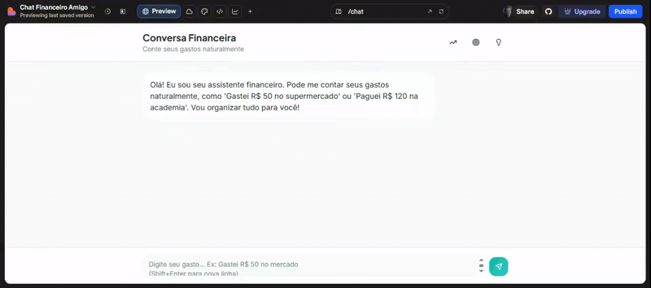
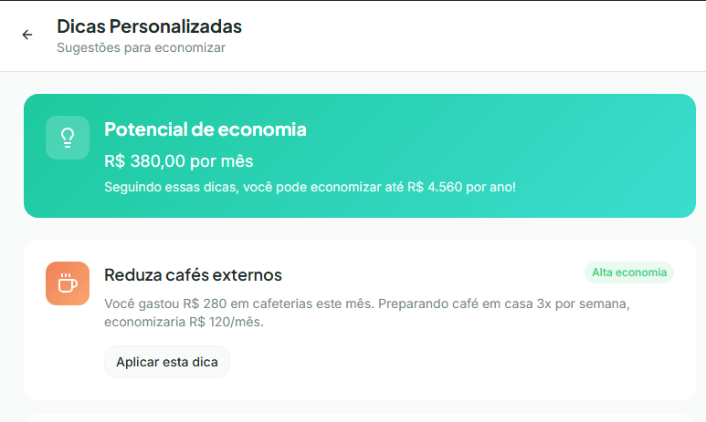
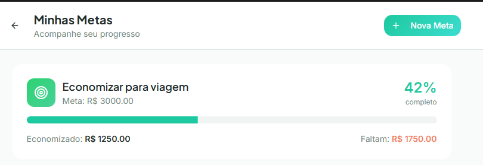

# 📊 App de Finanças Pessoais + IA

Este repositório contém o projeto do meu **App de Finanças Pessoais**, incluindo interações com uma Inteligência Artificial para auxiliar no desenvolvimento e reflexão sobre o processo.

# Plano de MVP
```
A proposta é criar um aplicativo de Organização de Finanças Pessoais que funcione por meio de conversas naturais com o usuário. O objetivo é simplificar o controle financeiro, evitando formulários complexos ou planilhas, e tornando a experiência prática e motivadora.

O público-alvo são pessoas que estão começando a organizar suas finanças e buscam uma solução sem complicação. O diferencial do app é permitir que o usuário registre seus gastos e ganhos diretamente pelo chat, de forma natural, como se estivesse conversando com um amigo.

#Como o chat deve funcionar
Mensagens fiéis: sempre mostrar suas mensagens exatamente como você digitou, sem alterar ou corrigir.

Interpretação automática: usar processamento de linguagem natural (NLP) para entender frases diferentes que significam a mesma coisa.

Exemplo:
“Gastei R$ 50 no mercado” → gasto em Alimentação.
“Paguei R$ 200 de aluguel” → gasto fixo em Moradia.
“Recebi R$ 3.000 de salário” → ganho em Salário.

Entrada múltipla: se você escrever vários gastos ou ganhos em uma única mensagem, o chat separa e classifica cada um.

Confirmação clara: o Agente Financeiro responde mostrando como interpretou sua mensagem, para você ter certeza que foi registrado corretamente.

Registro de gastos fixos O usuário informa despesas recorrentes como aluguel, água, luz e internet. O app registra automaticamente todo mês e pergunta se houve variação no valor. Relatórios destacam a proporção dos gastos fixos em relação à renda.

Registro de ganhos Além dos gastos, o usuário pode registrar entradas de dinheiro como salário, freelances, vendas ou outros ganhos. O sistema classifica automaticamente e calcula o saldo líquido (ganhos – gastos).

Metas financeiras O usuário define objetivos simples, como “Guardar R$ 200 este mês” ou “Economizar para viagem”. O app mostra o progresso em tempo real, considerando gastos fixos e variáveis.

Relatórios simples e personalizados Gráficos de pizza ou barra mostram a distribuição dos gastos. Comparação entre gastos fixos vs variáveis e ganhos vs despesas. Destaque para os maiores gastos e insights rápidos, como:

“Seus gastos fixos representam 55% da sua renda.”

“Você gastou 30% em lazer, acima da média.”

“Seu saldo líquido foi positivo em R$ 500.”

Agente Financeiro com dicas práticas O app oferece recomendações curtas e educativas, como:

“Sua conta de internet está acima da média. Já pensou em revisar o plano?”

“Tente limitar gastos com delivery a 1x por semana.”

“Você depende 90% do salário. Considere diversificar suas fontes de renda.”

Validação inicial
O MVP será testado com um grupo piloto de 10 a 20 pessoas. Métricas de sucesso:

Percentual de usuários que registram 5 ou mais gastos na primeira semana.

Percentual que cadastra pelo menos 3 gastos fixos.

Percentual que define uma meta financeira.

Percentual que registra pelo menos 1 ganho no primeiro mês.

O feedback deve avaliar se o chat é natural, se os relatórios são claros e se as dicas são úteis.
```

---

## 🎥 Prints e Vídeos das Interações

### Vídeos

1. Demonstração de controle das finanças.  
   

2. Relatório de despesas.
   

3. Dicas de finanças:  
   

4. Tela de metas  
   

---

## 📌 Resumo do App de Finanças Pessoais

O aplicativo tem como objetivo **facilitar o controle financeiro pessoal**, permitindo que o usuário:

- Registre entradas e saídas de dinheiro.
- Categorize despesas e receitas.
- Visualize relatórios e gráficos de desempenho financeiro.
- Defina metas de economia e acompanhe seu progresso.
- Receba insights automáticos para melhorar sua saúde financeira.

---

## 💡 Reflexão sobre o Processo

### ✅ O que funcionou bem

- A IA ajudou a **estruturar ideias rapidamente**, organizando o README de forma clara e objetiva.
- Sugestões criativas para melhorar a apresentação do projeto.
- Facilidade em gerar exemplos práticos e modelos prontos para uso.

### ⚠️ O que não funcionou como esperado

- Algumas respostas da IA foram **genéricas**, exigindo refinamento das perguntas para obter resultados mais específicos.
- Limitações em relação a **conteúdos visuais** (precisei ajustar manualmente os vídeos e imagens).

### 📚 O que aprendi sobre conversar com IAs

- Quanto mais **contexto e detalhes** eu forneço, melhores são as respostas.
- A IA é ótima para **organizar ideias** e acelerar tarefas repetitivas.
- É importante **validar e adaptar** as sugestões da IA ao contexto real do projeto.
